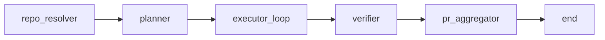
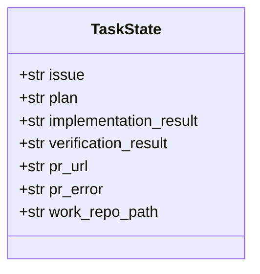
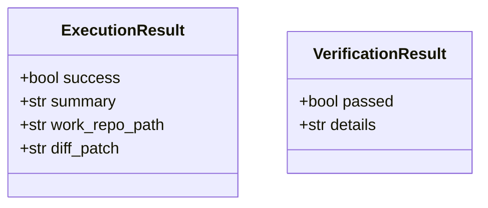
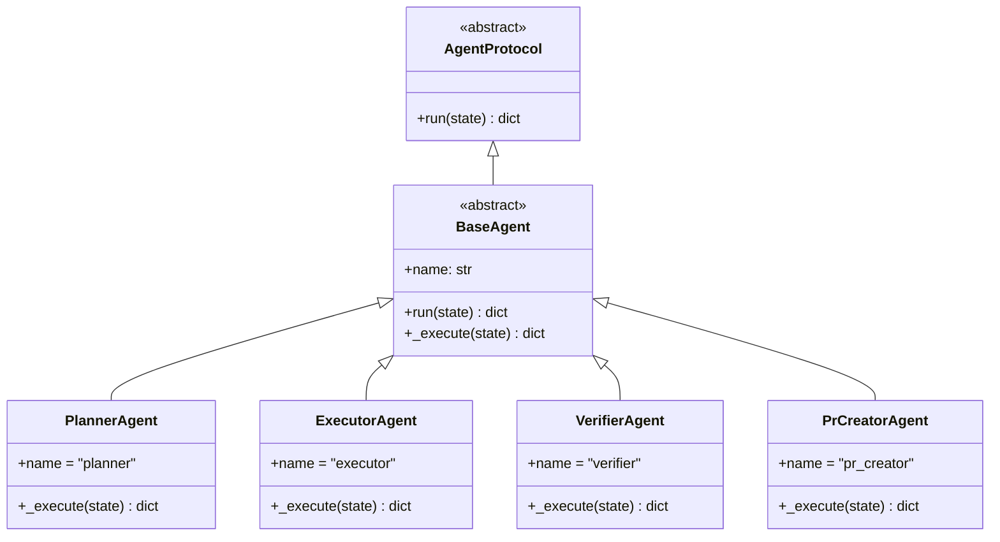
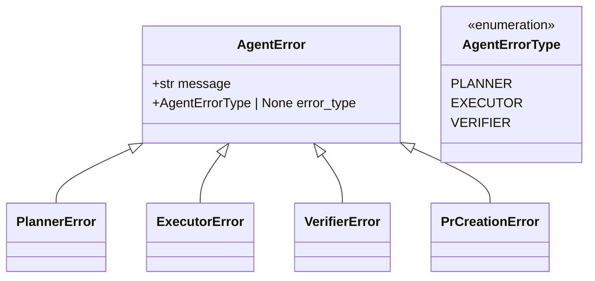

# Agent Graph

Minimal AI Engineering Agent MVP built with LangGraph. Automates code planning, execution,
verification, and automated GitHub pull request creation.

## Table of Contents

- [Quick Start](#quick-start)
  - [Step-by-Step](#step-by-step)
  - [Programmatic API](#programmatic-api)
- [Graph Topology](#graph-topology)
- [Data Model](#data-model)
- [Agent Architecture](#agent-architecture)
- [Exception Hierarchy](#exception-hierarchy)
- [Tech Stack](#tech-stack)
- [Requirements](#requirements)

## Quick Start

### Step-by-Step

#### 1. Create and activate a virtual environment

```bash
python3 -m venv .venv
source .venv/bin/activate   # on Windows: .venv\Scripts\activate
```

#### 2. Install the package (in editable mode)

```bash
pip install -e .
```

This builds `agent_graph` from source, so any code change is reflected immediately.

#### 3. Run the workflow

```bash
python -m agent_graph.main
```

Expected terminal output:

```
[Planner]
Analyzing issue: Add JWT authentication to FastAPI backend

[Executor / OpenHands]
Executing implementation plan...

1. Inspect repository
2. Add implementation for: Add JWT authentication to FastAPI backend
3. Run tests
4. Create patch

[Verifier]
Running verification pipeline...

[PR Creator]
  Pull request created: https://github.com/owner/repo/pull/42
```

Requires `GITHUB_TOKEN` with permission to push branches and open pull requests.
If there are no file changes, the workflow completes without opening a PR.

Custom task:

```bash
python -m agent_graph.main --issue "Add OAuth2 login flow"
```

Jira ticket with extra developer context (scope beyond the ticket body):

```bash
python -m agent_graph.main \
  --issue "https://company.atlassian.net/browse/MINSKY-123" \
  --repo "https://bitbucket.org/team/admin-ui.git,https://bitbucket.org/team/api.git" \
  --prompt "Fix email verified flag in both frontend and backend; backend is source of truth."
```

Deploy environment git tag (after branch push, before/at PR creation):

```bash
python -m agent_graph.main \
  --issue "https://company.atlassian.net/browse/MINSKY-123" \
  --repo "https://bitbucket.org/team/api.git" \
  --deploy-env dev
```

The tag format is `env.{env}.branch.{branch}` (e.g. `env.dev.branch.hotfix/my-fix`). The tag is created at the commit HEAD and pushed in the same `git push` as the branch so CI/CD sees it when the branch webhook fires. You can also set `DEPLOY_ENV` in `.env` or infer the environment from `--prompt` / issue text (e.g. `deploy to stage`).

#### 4. Install dev dependencies and run tests

```bash
pip install -e ".[dev]"
python -m pytest tests/ -v
```

### Programmatic API

```python
from agent_graph import build_graph
from agent_graph.state import TaskState

# Build the compiled LangGraph StateGraph
graph = build_graph()

# Define initial state
state: TaskState = {
    "issue": "Add logout endpoint",
    "input_prompt": "",
    "plan": "",
    "implementation_result": "",
    "verification_result": "",
    "target_repo_path": "https://github.com/owner/repo.git",
    "work_repo_path": "",
    "diff_patch": "",
    "github_issue_url": "",
    "pr_url": "",
    "pr_error": "",
}

# Execute the workflow
result = graph.invoke(state)
```

Override any agent node with a custom function (useful for CI or testing):

```python
from agent_graph import build_graph


def mock_pr_creator(state: dict) -> dict:
    return {"pr_url": "https://github.com/owner/repo/pull/1", "pr_error": ""}


graph = build_graph(pr_creator_fn=mock_pr_creator)
result = graph.invoke(state)
```

## Graph Topology

The workflow is a directed state machine that ends after PR creation (or skip when there are no changes).
For Jira/Bitbucket issues, `repo_resolver` runs first to detect target repositories from the issue text.



**Planner phase:** clones each detected repo, runs a static dependency scan, then OpenHands in Docker (read-only analysis) to produce per-repo `repo_summary` and an aggregated `plan`.

**Executor phase:** reuses planner clones (`planner_clone_path`), resets git to baseline, then OpenHands implements the plan per repository.

## Data Model

All agents communicate through a single `TaskState` `TypedDict`:



- `issue` — original task description.
- `plan` — aggregated implementation plan from the planner (includes per-repo OpenHands analysis).
- `target_repos` — list of `RepoRecord` entries (`target_repo_path`, `planner_clone_path`, `repo_summary`, `work_repo_path`, …).
- `implementation_result` — summary of code changes from the executor.
- `verification_result` — test/lint/static-analysis output from the verifier.
- `work_repo_path` — host path to the clone with OpenHands edits (used by PR creator).
- `pr_url` — URL of the created pull request (empty if skipped or failed).
- `pr_error` — error message when PR creation failed.

Optional env: `GIT_CLONE_TIMEOUT` (default 120s), `PLANNER_MAX_ITERATIONS` (default 80), `EXECUTOR_MAX_ITERATIONS` (default 500).

Pydantic models keep structured payloads typed and validated:



## Agent Architecture

Every agent implements the `AgentProtocol` and extends `BaseAgent`, which provides automatic
logging and error handling:



Factory functions live in `graph_builder.py`. The `build_graph()` function accepts optional
callback overrides so you can swap in mock or production agents without changing the graph itself.

## Exception Hierarchy

All agents raise from a common `AgentError` base so callers can wrap the full pipeline in a
single `try/except`:



## MCP Integration

The agent graph can use [Model Context Protocol](https://modelcontextprotocol.io/) servers for documentation lookup, Jira ingest, and (optionally) OpenHands executor tools.

### Configuration

- Project config: [`mcp.config.json`](mcp.config.json) — enable servers and set `transport` (`stdio` or `http`)
- Secrets: `.env` only (e.g. `CONTEXT7_API_KEY`, `JIRA_CLOUD_ID`)
- Optional merge from Cursor: `MCP_USE_CURSOR_CONFIG=1` reads `~/.cursor/mcp.json` (project entries override)

### Host-side MCP (planner)

When the issue mentions libraries (FastAPI, LangGraph, React, etc.), the planner calls **Context7** via local stdio (`npx -y @upstash/context7-mcp`) and appends docs to `repo_context`.

Disable with `MCP_CONTEXT7_ENABLED=0`.

Requires `npx` on the host (same as Cursor).

### Jira via MCP (optional)

```bash
python -m agent_graph.main --jira --jira-mcp --jira-project PROJ
```

Or set `JIRA_USE_MCP=1` and enable the `atlassian` server in `mcp.config.json`. REST fetcher remains the default.

### Executor MCP (OpenHands)

Set `OPENHANDS_MCP_ENABLED=1` to pass MCP servers into the OpenHands `Agent` inside Docker. By default only **HTTP** servers are included (`OPENHANDS_MCP_HTTP_ONLY=1`) because stdio/`npx` may be unavailable in the agent-server image.

## Tech Stack

| Layer             | Technology   | Purpose               |
|-------------------|------------- |-----------------------|
| Workflow engine   | LangGraph    | State-machine runner  |
| Schema validation | Pydantic     | Runtime type checks   |
| State definition  | `TypedDict`  | Lightweight interface |
| Linting           | Ruff         | Fast Python linter    |
| Static analysis   | mypy         | Type checking         |
| Testing           | pytest       | Unit & integration    |

## Requirements

- Python >= 3.11
- See `[project]` dependencies in [`pyproject.toml`](pyproject.toml) for the full list.

To install dev tooling in one step:

```bash
pip install -e ".[dev]"
```
